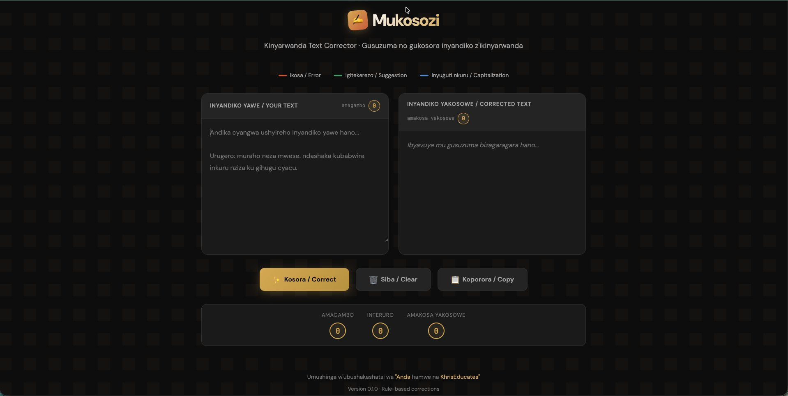
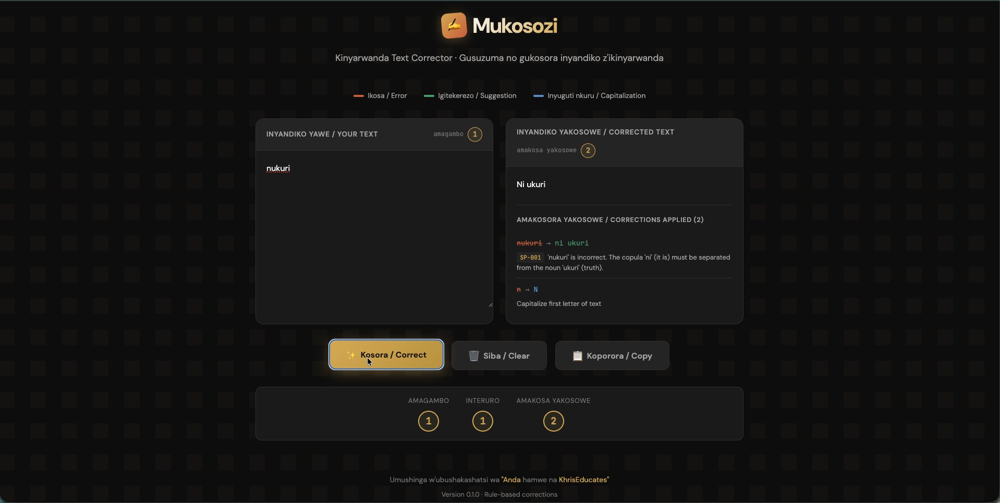
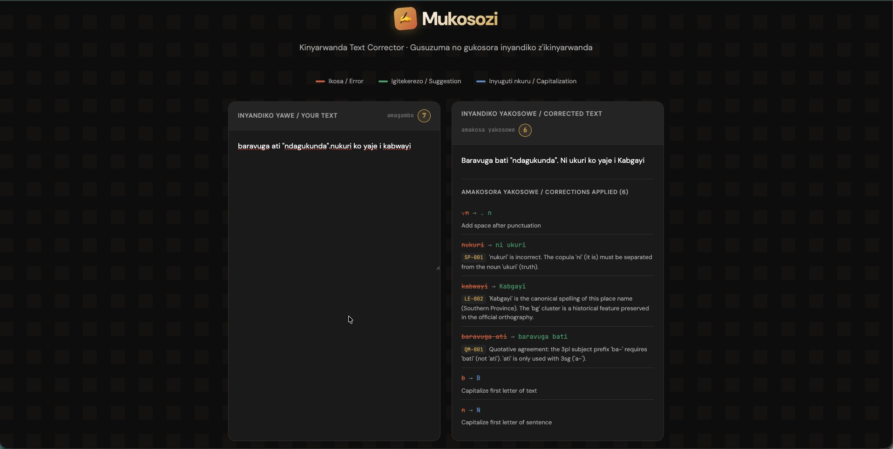
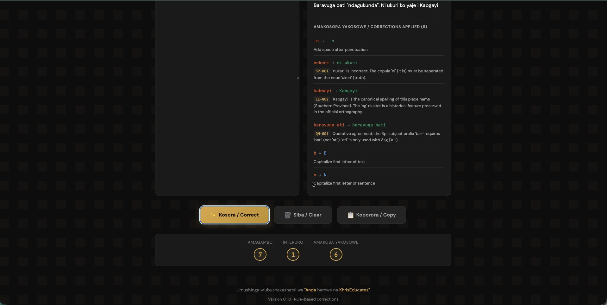

# Mukosozi

> *Open-source Kinyarwanda grammar correction tool — rule-based text correction for the language of ~12M speakers.*

[](LICENSE)
[](LICENSE-DATA)
[](#status--roadmap)

**Mukosozi** (Kinyarwanda: *the corrector, the one who corrects*) is a Kinyarwanda text correction tool. It targets punctuation, spacing, capitalization, and morphological errors that affect written Kinyarwanda — a Bantu language spoken by approximately 12 million people, with limited NLP tooling available.

The project is **authored and maintained by a native Kinyarwanda speaker** and grounded in explicit, documented linguistic rules — not opaque models. Every correction is traceable to a rule with a clear, reviewable explanation.

---

## What it does (v0.1.0)

Current capabilities, all rule-based and running client-side in the browser:

- **Punctuation correction** — spacing around `.`, `,`, `!`, `?`, removal of duplicates
- **Capitalization correction** — sentence-initial caps, proper nouns (place names, days, months, common religious and geographic terms)
- **Spacing correction** — common merge/split errors (e.g. `nukuri` → `ni ukuri`)
- **Lexical exception handling** — words with special rules (e.g. `ubukwe`, which has no plural; `Kabgayi`, which has a unique historical spelling)
- **Quotative marker agreement** — subject-prefix concord (`baravuga bati`, not `baravuga ati`)

---

## Quick start

Mukosozi v0.1.0 is a single-file web application. No build step, no dependencies.

```bash
git clone https://github.com/mukosozi/mukosozi.git
cd mukosozi
open mukosozi.html       # macOS — or just double-click the file
```

Type or paste Kinyarwanda text on the left; corrected text appears on the right.

---

## Screenshots

### Default state



The Mukosozi interface on first load. Bilingual labels in Kinyarwanda and English, dark theme with gold accents inspired by Imigongo geometric tradition, and a clear legend mapping correction types to colors.

### Single correction example



A one-word input — `nukuri` — triggers rule **SP-001**: the copula `ni` ("it is") must be written separately from the noun `ukuri` ("truth"). A capitalization fix is also applied (note the blue styling matching the legend). Each correction shows its rule ID and a bilingual explanation.

### Multi-rule correction





A more complex input — `baravuga ati "ndagukunda".nukuri ko yaje i kabwayi` — demonstrates six corrections across four distinct rule families:

- **Punctuation spacing** — missing space after a period
- **SP-001** — `nukuri` split into `ni ukuri`
- **LE-002** — `kabwayi` normalized to the canonical orthography `Kabgayi`
- **QM-001** — quotative marker agreement: 3rd-person plural subject `ba-` requires `bati` (not `ati`, which only agrees with 3rd-person singular `a-`)
- **Capitalization** — sentence-initial and post-period capitalization

---

## Project structure

```
mukosozi/
├── mukosozi.html        # The web app (HTML + CSS + JS, single file)
├── data/
│   └── word_bank.json   # Linguistic rules, exceptions, and neologisms
├── screenshots/         # README screenshots
├── LICENSE              # AGPL-3.0 — governs source code
├── LICENSE-DATA         # CC BY-NC-SA 4.0 — governs linguistic data
├── NOTICE               # Copyright and dual-licensing summary
├── CONTRIBUTING.md      # How to contribute
├── .gitignore
└── README.md
```

---

## Status & roadmap

**v0.1.0 is a deliberate MVP.** The architecture, naming, and licensing are set up for long-term development; the current feature set covers a small but well-defined slice.

| Phase | Focus | Status |
|---|---|---|
| **0.1** | Rule-based corrections (punctuation, spacing, lexical exceptions, quotative markers) | ✅ Released |
| **0.2** | Expanded morphology (noun-class agreement, verb conjugation) | 🛠 In progress |
| **0.3** | Per-rule documentation pages; expanded contribution workflow | 📋 Planned |
| **0.4** | Backend API and ML-based correction trained on synthetic error data | 📋 Planned |
| **1.0** | Online Kinyarwanda dictionary with systematically reviewed neologisms | 📋 Long-term vision |

---

## Linguistic foundation

Mukosozi's rules are not pulled from training data — they are documented explicitly by a native speaker, with the goal that every correction be explainable, auditable, and revisable.

The `data/word_bank.json` file is a growing structured knowledge base of:

- **Grammar rules** (e.g. quotative marker agreement, noun-class concord)
- **Lexical exceptions** (uncountable nouns, unique proper noun spellings, idiomatic phrases)
- **Neologisms** — Kinyarwanda terms for modern concepts, with morphological analysis and rationale

This is designed to eventually serve as the foundation for the first comprehensive online Kinyarwanda dictionary, with a rigorous review process for new terminology.

---

## Related work

- **[LinguaMedica RW](https://linguamedica.rw)** — RAG-based English–Kinyarwanda medical translation system, also built and maintained by the same author. Live, with a curated medical terminology base.

---

## License

Mukosozi uses **dual licensing** to balance openness with sustainability:

- **Source code** — [GNU Affero General Public License v3.0](LICENSE) (AGPL-3.0). You may use, modify, and distribute the code under AGPL terms, including the requirement to disclose source code of network-accessible derivatives.
- **Linguistic data** (`data/word_bank.json` and any derived datasets in this repository) — [Creative Commons Attribution–NonCommercial–ShareAlike 4.0 International](LICENSE-DATA) (CC BY-NC-SA 4.0). Free for research and non-commercial use with attribution; commercial use requires separate written permission from the maintainer.

See [`NOTICE`](NOTICE) for the full attribution and licensing summary, including the policy on neologisms and commercial licensing.

---

## Contributing

Contributions are welcome — especially from Kinyarwanda speakers and linguists. Please read [`CONTRIBUTING.md`](CONTRIBUTING.md) before opening an issue or pull request.

Linguistic accuracy is critical to this project. Proposed rules and corrections are reviewed before merging, and native-speaker validation is required for linguistic changes.

---

## Citation

If you use Mukosozi in academic work, please cite:

```
Mumaragishyika, C. (2026). Mukosozi: A Kinyarwanda grammar correction tool (v0.1.0).
https://github.com/mukosozi/mukosozi
```

---

## Maintainer

**Christophe Mumaragishyika**
Contact: `mukosozi.rw@gmail.com`

---

© 2026 Christophe Mumaragishyika. All rights reserved except where explicitly licensed under the terms above.
